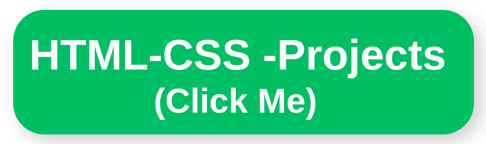
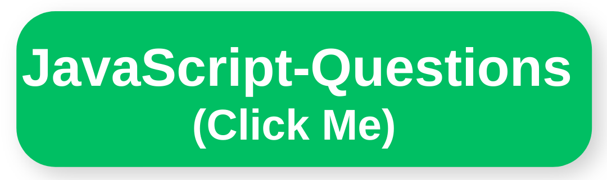

### Hi there 👋

<!--
**CemalettinDimlioglu/CemalettinDimlioglu** is a ✨ _special_ ✨ repository because its `README.md` (this file) appears on your GitHub profile

 
## :wave: Hi there, I'm Cemalettin
 :heavy_check_mark: I'm a Front-End Developer. 
 
:fireworks: Exploring routes to new visions and be a part of the new visions. 
 
 :face_with_monocle: A new age enthusiast. 
 
:coffee: Coffee is how I keep up with code
## :man::woman: Connect with me:

 

 
<h2 align="center">:rocket:Technical Skills</h2>

 

 

 

 

<!--
 
-->

## :star2: My Projects:

  

 
<h2 align="center">My Top Projects</h2>
###
Project Demo       |Libraries and Technologies I use     |Project Preview
:-------------------------|-------------------------|-------------------------
[IOS Calculator](https://axel-ac.github.io/IOS-calculator/) <h3>[Repo](https://github.com/axel-ac/IOS-calculator)</h3> | Vanilla JS | 
[Bootstrap Web Page](https://axel-ac.github.io/Boostrap-Project/) <h3>[Repo](https://github.com/axel-ac/Boostrap-Project)</h3> | Boostrap |
[Sass Website Page Design](https://axel-ac.github.io/Sass-project/) <h3>[Repo](https://github.com/axel-ac/Sass-project)</h3> | Sass, Scss |
 
<h2 align="center">:bulb:Most Used Language</h2>

 
    
  

(333 kB)
