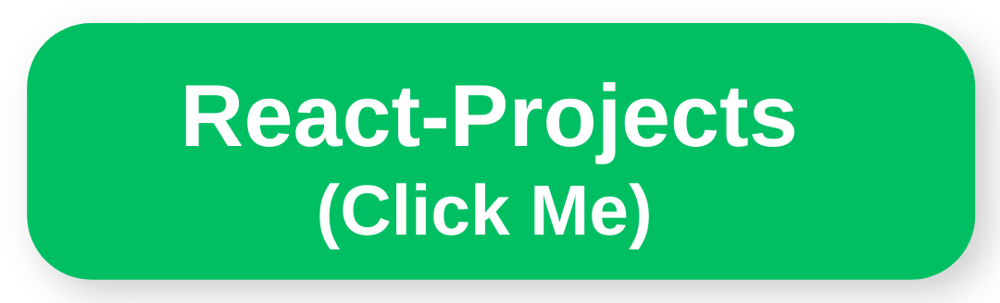
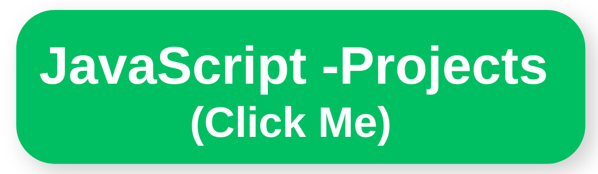

 

## :wave: Hi there, I'm Cemalettin

 ✔️ I'm a Front-End Developer. 
 
 Exploring routes to new visions and be a part of the new visions.   
 
 😜 A new age enthusiast. 
 
 ☕ Coffee is how I keep up with code

## :man::woman: Connect with me:

 

 

<h2 align="center">:rocket:Technical Skills</h2>

 

 
<!-- 
  -->
 

 

<!--
 
-->

## :star2: My Projects:

  

 

<h2 align="center">MY Projects-Coming Soon😌</h2>

###

Project Demo       |Libraries and Technologies I use     |Project Preview
:-------------------------|-------------------------|-------------------------
[IOS Calculator](https://github.com/CemalettinDimlioglu/calculator) <h3>[Repo](https://github.com/CemalettinDimlioglu/calculator/edit/master/README.md)</h3> | Vanilla JS                  
 |

[IOS Calculator](https://github.com/CemalettinDimlioglu/Checkout-Page) <h3> [Repo](https://github.com/CemalettinDimlioglu/calculator/edit/master/README.md)</h3> | Vanilla JS                  
[CemalettinDimlioglu-Checkout-page](https://user-images.githubusercontent.com/118989157/232305454-7a717072-3a6a-4eef-80de-1716fc81a190.gif)|

<h2 align="center">:bulb:Most Used Languages</h2>

 

    
  

